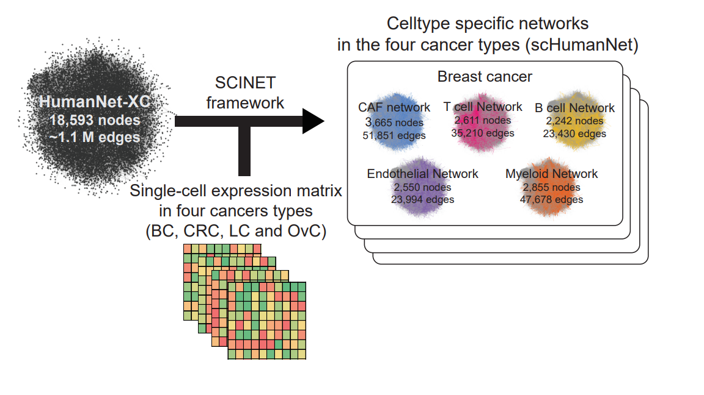
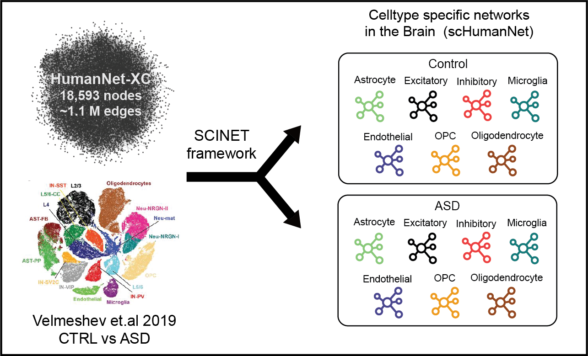

<!-- README.md is generated from README.Rmd. Please edit that file -->

# scHumanNet

Construction of cell-type-specific functional gene network, with SCINET
and HumanNetv3

### Framework Introduction

scHumanNet enables cell-type specific networks with scRNA-seq data. The
[SCINET framework (Mohammade et al. Cell Syst.
2019)](https://www-sciencedirect-com.ezp-prod1.hul.harvard.edu/science/article/pii/S2405471219303837?via%3Dihub)
takes a single cell gene expression profile and the “reference
interactome” HumanNet v3, to construct a list of cell-type specific
network. With the modified version of SCINET source code and the
detailed tutorial described below, researchers could take any
single-cell RNA sequencing (scRNA-seq) data of any biological context
(e.g., disease) and construct their own cell-type specific network for
downstream analysis.



For a given scRNA-seq data set, the SCINET framework utilize imputation,
transformation, and normalization from the [ACTIONet package(Mohammadi
et al. Nat. Commun.
2018)](https://www-nature-com.ezp-prod1.hul.harvard.edu/articles/s41467-020-18416-6)
to robustly capture cell-level gene interactions. HumanNet v3 with 1.1
million weighted edges are used as a scaffold information to infer the
likelihood of each gene interactions. A subsampling scheme for each
cell-type clusters (cell groups) ensures retaining of accurate gene
interaction strength despite the incompleteness of single cell dataset
at high resolution. Overall, we show that HumanNet v3 not only allow
gene prioritization in broad spectrum of diseases, but through
construction of context specific cell-type networks, also allow an
in-depth study of disease heterogeneity and its underlying mechanism at
a cellular level.

### Setting up the Environment

For running scHumanNet, we recommend a `conda` envrionment to install
packages in the `packages` folder

``` bash
$ conda create -n scHumanNet R==4.0
$ git clone https://github.com/JunhaCha/scHumanNet.git
$ conda activate scHumanNet
(scHumanNet) $ conda install --file ./scHumanNet/packages/requirements_scHumanNet.txt
```

install the modified version of ACTIONet

``` bash
(scHumanNet) $ R CMD INSTALL ./scHumanNet/packages/ACTIONet_2.0.18_HNv3
```

start R and install SCINET and scHumanNet

``` r
devtools::install_github("shmohammadi86/SCINET")
devtools::install_github("JunhaCha/scHumanNet")
```

### Load required libraries

(add Seurat if necessary)

``` r
library(scHumanNet)
library(ACTIONet)
library(SCINET)
library(Seurat)
library(igraph)
library(SingleCellExperiment)
library(purrr)
library(dplyr)
```

## Construction of scHumanNet (Example 1)

For the first example case, we showcase the construction of scHumanNet
using publically accessivble pan-cancer dataset from [Qian et al. Cell
Research
2020](https://www-nature-com.ezp-prod1.hul.harvard.edu/articles/s41422-020-0355-0).
The 10X count folder and the metadata can be downloaded from
<http://blueprint.lambrechtslab.org>

``` r
counts <- Read10X('/your/path/to/CRC_counts/')
meta <- read.table('/your/path/to/CRC_metadata.csv', header = T, sep = ',')
```

Convert to sce  
This tutorial converts count data and metadata to sce obeject from
`SingleCellExperiment`, to be used as intput for network construction

``` r
data <- SingleCellExperiment(assays = list(logcounts = counts), colData = meta)
```

For seurat objects, manually insert count data and metadata within the
`SingleCellExperiment()`, or use the `as.SingleCellExperiment()`
provided in the `Seurat` package.

``` r
data <- SingleCellExperiment(assays = list(logcounts = seurat_object@assays$RNA@counts), colData = seurat_object@meta.data)
data <- Seurat::as.SingleCellExperiment(seurat.object)
```

prior to scHumanNet construction, reduce data and use the ace class from
the ACTIONet package

``` r
ace <- reduce.ace(data)
```

The column `CellType` of the metadata here indicates the column where
each barcode is annotated from the user’s preferred choice of methods

``` r
ace[['Labels']] <- meta$CellType
```

Load HumanNetv3 interactome and retrieve cell-type specific interactions. Command `data('HNv3_XC_LLS')` loads the interactome as an igraph object named `graph.hn3`
``` r
data('HNv3_XC_LLS')
ace <- compute.cluster.feature.specificity(ace, ace$Labels, "celltype_specificity_scores")
Celltype.specific.networks = run.SCINET.clusters(ace, specificity.slot.name = "celltype_specificity_scores_feature_specificity")
```

Sort each genepair alphabetically and add LLS weight from HumanNetv3.
Elements of `sorted.net.list` are stored as edgelist. This is later useful for assessing edge overlap between scHumanNets

``` r
sorted.net.list <- SortAddLLS(Celltype.specific.networks, reference.network = graph.hn3)
```

Check each element of list and save scHumanNets, with both SCINET and LLS weights included in the edgelist for downstream analysis. R code used to analyze pan-cancer scHumanNet is included in the `figures` folder

``` r
lapply(sorted.net.list, head)
saveRDS(sorted.net.list, './sorted_el_list.rds')
```

## Network Connectivity Deconvolution with user input geneset
With scHumanNet we also provide a computaitonal framework to statistically asssess the connectivty of a given geneset at the cellular level of scHumanNets. In this example we use the Immune Checkpoint molecules(ICMs) as a geneset to assess in what celltypes these genesets have strong co-functional characteristic. In common cases user may use a DEG derived genesets or bulk sample derived signatures genes to find whether the genesets' cofunctionality is supported constructed scHumanNet models. 

The output of `Connectivity()` is a list with three elements: 1. the null distribution vector of selected random gene's connectivity. 2. non-parametric pvalue of the user-input geneset. 3. geneset vector that was detected in the input scHumanNet

``` r
data("ICMs")
icm.connectivity <- DeconvoluteNet(network = sorted.net.list, geneset = icm.genes)
icm.connectivity.tcell <- Connectivity(network = sorted.net.list[["T_cell"]], geneset = icm.genes, simulate.num = 10000)

#we can also perform a conncectivity test for all scHumanNets. this will take some time...
icm.connectivity.nulltest.list <- lapply(sorted.net.list, function(net){Connectivity(network = net, geneset = icm.genes, simulated.num=10000))
```

## Using multiple user genesets for comparison
Of note, we can also compare the functional connectivity of multiple genesets. In this case, the geneset is provided as a named list for `DeconvoluteNet()`. In this case the output dataframe contains the


## Differential Network analysis with scHumanNet (Example 2)

In this example we provide a framework for a common downstream network
analysis, identification of differential hub in a control vs disease
scRNA-seq study. Here we present an example cell-type specific gene
prioritization assocated with ASD. Differential hub gene is identified
that significantly differs in centrality for each neuronal celltypes of
healthy vs ASD scHumanNet(data derived from [Velmeshev et al. Science
2019](https://pubmed.ncbi.nlm.nih.gov/31097668/)).



Download the publically accessible data `meta.txt` and `10X folder` from
<https://autism.cells.ucsc.edu>

``` r
counts <- Seurat::Read10X('/your/path/to/10X_out/')
meta <- read.table('/your/path/to/meta.txt', header = T, sep = '\t')

#check if barcodes match
rownames(meta) <- meta$cell
meta$cell <- NULL
identical(colnames(counts), rownames(meta))

#merge annotated celltypes to larger granularity
#neu_mat, NRGN neurons are seperated and will be excluded because it is either similar to Excitatory neurons based on UMAP analysis and is thus considered ambiguous
meta$celltypes_merged <- ifelse(meta$cluster %in% c('AST-FB','AST-PP'), 'Astrocyte',
                                ifelse(meta$cluster %in% c('IN-PV', 'IN-SST','IN-SV2C', 'IN-VIP'), 'Inhibitory',
                                       ifelse(meta$cluster %in% c('L2/3', 'L4', 'L5/6','L5/6-CC'), 'Excitatory',
                                              ifelse(meta$cluster %in% c('Neu-mat','Neu-NRGN-I', 'Neu-NRGN-II'), 'Others', 
                                                     as.character(meta$cluster)))))
```

To make a control vs disease network for each celltype we make a new
column that combines celltype and disease annotation For the Velmeshev
2019 data, column name `diagnosis` and `celltypes_merged` includes
disease and celltype annotation respectively.

``` r
meta$celltype_condition <- paste(meta$diagnosis, meta$celltypes_merged, sep = '_')
```

Construct celltype specific networks for control and disease similarly
as above

``` r
data <- SingleCellExperiment(assays = list(logcounts = counts), colData = meta)
ace = reduce.ace(data)
ace[['Labels']] <- meta$celltype_condition
ace = compute.cluster.feature.specificity(ace, ace$Labels, "celltype_specificity_scores")
Celltype.specific.networks = run.SCINET.clusters(ace, specificity.slot.name = "celltype_specificity_scores_feature_specificity")
```

Add LLS weight from HumanNetv3 for downstream analysis

``` r
data('HNv3_XC_LLS')
sorted.net.list <- SortAddLLS(Celltype.specific.networks, reference.network = graph.hn3)
```

In this tutorial we will select degree, sum of all weights connecting
the node, as a centrality measure to prioritize genes. The function
`GetCentrality` also supports betweenness, closeness, and eigenvector
centrality as well.

``` r
strength.list <- GetCentrality(method='degree', net.list = sorted.net.list)
```

Percentile rank is used to account for netork size differences. For
every gene in the reference interactome, if a node is not existent in
the scHumanNet, 0 value is assigned.

``` r
rank.df.final <- CombinePercRank(strength.list)
```

Get top 50 central genes for each celltype

``` r
top.df <- TopHub(rank.df.final, top.n = 50)
head(top.df)
```

| Control\_Excitatory | ASD\_Excitatory | …   | ASD\_Others |
|---------------------|-----------------|-----|-------------|
| ULK1                | ULK1            | …   | UQCRC1      |
| MTFMT               | GRIN2B          | …   | NDUFA8      |
| …                   | …               | …   | …           |
| COX4I1              | RPE             | …   | NDUFA3      |

Get the differential percentile rank value for each genes with function
`DiffPR()`, where the output is a dataframe with genes and the
corresponding diffPR value for each scHumanNets. The input of DiffPR
includes the output of CombinePercRank(), metadata, column name of the
annotated celltypes and condition(disease & control), and of the two
annotation which will be used as a control. This example dataset
`diagnosis` contains `Control` and `ASD`, and the column
`celltypes_merged` stores the annotated celltypes.

``` r
diffPR.df <- DiffPR(rank.df.final, celltypes = 'celltypes_merged', condition = 'diagnosis', control = 'Control', meta = meta)
head(diffPR.df)
```

| Astrocyte | Astrocyte\_ASD-Control | …   | Others | Others\_ASD-Control |
|-----------|------------------------|-----|--------|---------------------|
| AR        | -1.0000000             | …   | UQCRC2 | -0.9987382          |
| FASN      | -0.9996068             | …   | NDUFB8 | -0.9981073          |
| …         | …                      | …   | …      | …                   |
| ACAA1     | 0.9967987              | …   | NDUFB3 | -0.9946372          |

Finally, we provide a nonparametric method to filter differential hubs
with the function `FindDiffHub()`. Input requires the output of DiffPR,
and the user-defined pvalue threshold. The output consists of a gene
column, diffPR value sorted from negative to positive value, pvalue, and
the celltype. To extract genes, use the `gene` column instead of
`rownames()`.

``` r
diffPR.sig <- FindDiffHub(diffPR.df, p.value = 0.05)
diffPR.sig
```

|          | gene   | diffPR     | pvalue      | celltype  |
|----------|--------|------------|-------------|-----------|
| TRIM21   | TRIM21 | -0.8537161 | 0.04973245  | Astrocyte |
| FOXH1    | FOXH1  | -0.8568620 | 0.04910293  | Astrocyte |
| …        | …      | …          | …           | …         |
| COX16.1  | COX16  | 0.9793814  | 0.007617547 | Others    |
| MAP2K1.1 | MAP2K1 | 0.9888977  | 0.003414762 | Others    |
